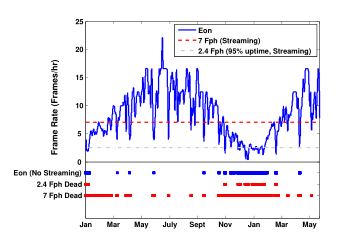

% Software and Compilers
% Philip Dexter
% \today

# Why worry?

We know already

# How to reduce it?

* algorithmic 
* architectural
* logic
* circuit

# Compiler optimization

$E = P * T$

P = average power
T = num of execution cycles

Two ways to reduce power

* Reduce execution cycles
	* Shouldn't reduce performance
* Reduce average power of program

# Average power

$P = \frac{1}{2} \cdot C \cdot V \cdot Vdd^2 \cdot f \cdot E$

C = load capacitance

Vdd = supply voltage

f = clock frequency

E = transition count

# Optimizing

Bus wires have large capacitance loading

Reduce transition activities of buses

# VLIW processor architecture

Depends on programs to make decisions about parallelism

* Increase complexity to compilers

# Previous/current approaches

All require increased hardware complexity

* Pipelining
* Superscalar
* Out-of-order execution

# Tradeoff

Since deciding which instructions can run in parallel is pushed to
software, hardware complexity can be substantially reduced

* Check dependencies at software or hardware
	* Check once or everytime you run it

# Back to problem

Vertical/horizontal scheduling

Vertical - how to pack instructions in parallel

Horizontal - how to pack instructions in sequence

Focus on reducing switching activities for instruction bus

# Target machine

3 ALUs

1 wildcard (ALU | branch/flow control | load/store)

# Cost model

Hamming distance

* Number of bit differences between two binary strings

$1\color{red}0\color{white}0\color{red}1\color{white} \color{red}0\color{white}01\color{red}0\color{white} \color{red}1\color{white}0\color{red}1\color{white}\color{red}0\color{white} \color{red}0\color{white}1\color{red}1\color{white}1 \color{red}1\color{white}0\color{red}1\color{white}0 1\color{red}1\color{white}\color{red}0\color{white}1 0\color{red}0\color{white}01 0\color{red}0\color{white}00$
$1\color{red}1\color{white}0\color{red}0\color{white} \color{red}1\color{white}01\color{red}1\color{white} \color{red}0\color{white}0\color{red}0\color{white}\color{red}1\color{white} \color{red}1\color{white}1\color{red}0\color{white}1 \color{red}0\color{white}0\color{red}0\color{white}0 1\color{red}0\color{white}\color{red}1\color{white}1 0\color{red}1\color{white}01 0\color{red}1\color{white}00$

Hamming distance = num red = 15

# Bus transition cost

Suppose $X, Y$ are two consecutive VLIW instructions

The bus transition cost is simply their hamming distance

# Plan

Two phases

1. Schedule instructions for performance
1. Re-arrange instructions for low power

# Horizontal scheduling

Given $n$ instructions, how do you minimize transition activity of
instruction buses (how do you minimize hamming distance between $n$
bit vectors)

Weighted bipartite graph matching

Greedy

# Vertical scheduling

Have to be sure that any power minimization technique doesn't incur
performance penalties

Use data dependency graph and critical path information

NP-Hard

# Results

Average of 13% decrease in switching activities

# Eon

An energy aware language and runtime system for perpetual computing
systems

# Difficulties

* Dynamic energy availability
* Varying energy costs
* Varying hardware platforms

# Energy states

Systems go through transitions in energy states

* Execute only the control flows marked for specific energy states
* Different functionality or data quality based on energy availability

# Runtime system

Runtime system handles the complexity of adaption

* Dynamically adjusts the execution rate
* Enables or disables application features
* Portable across arbitrary energy profiles

# Runtime system

Code

* Describe sequence of operations reacting to external events

Runtime system

* Measures the probable
	* costs of each operation
	* workload in system
	* amount of energy system will aquire

# The language

Built on top of Flux, an existing language used to describe the flow
of data through components of a system (typically used to program high
performance servers)

# Adaption policies

Could be represented as utility functions, but that's too complicated
for the programmer

Instead, programmers specify state orderings

# Specific ways to save

Adaptive timers

* Change interval that costly operations are performed
	* GPS for example

Lowering data quality

* Lower quality images
* Store locally instead of streaming

# Results

User study

* Programmers develop faster

System study

* Adapts to best energy policy
* Less downtime

# Thank you

* Questions?

# Results

System study

