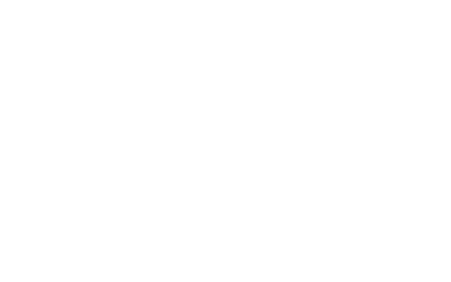
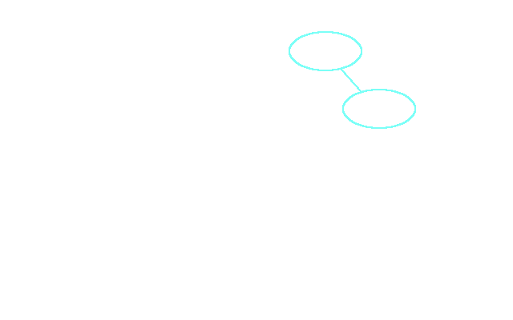
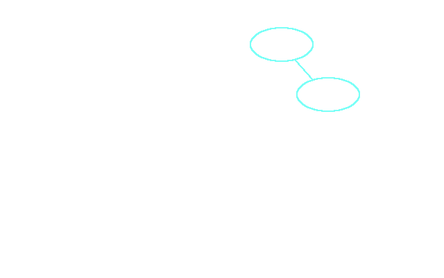

% Efficient graph representations in functional languages
% Philip Dexter
% \today

# Functional data types

\centering

**persistent** and **immutable** data structures

**zero** side effects

$\downarrow$

costly updates to large data structures

# Inefficient

	type Graph = ([Node], [Edge])

Naive representations are beyond terrible

Updating an adjacency list takes $O(N)$ - want $O(1)$

# Introduce lazy mutations

	data Delta = AddNode n | AddEdge e |
			  RemoveNode n | RemoveEdge e
	--               %also keep a list of mutations%
	--                               %$\downarrow$%
	type Graph = ([Node], [Edge], [Delta])

**Question**

* does this help?

# Example

	-- %given `graph' is a somewhat large graph structure%
	removeNode 5 graph
	-- old way
	-- %we must search through the entire% [Node] %list%
	-- %when we find it we must copy all preceding nodes%
	-- %and reconstruct the beginning of the linked list%
	-- new way
	-- %make an $O(1)$ prepend to% [Delta] %list%

# Delaying the inevitable

Pros

* Simple
* Improves performance.. maybe

Cons

* Invalidates graph
* Doesn't _do_ anything
* What happens when you want to search?
	* Need to now search `[Node]`{.haskell} and `[Delta]`{.haskell} lists

# Free optimization

Transform graph representation into a binary search tree

	--               %key $\downarrow$%      %$\downarrow$ value%
	type Graph = BTree Node AdjList
	type AdjList = [Edge]

Update is now $O(\mathrm{log_2}N)$

# Revisit delta list

	--                                 %$\downarrow$%
	type Graph = BTree Node AdjList [Delta]

# Benefits of the delta list

The delta list can

* delay potentially unnecessary operations
	* the node/edge may never be needed
	* an add then a delete could annihilate each other
* batch process mutations
	* apply costly mutations all at once to save data replication
	* when?

# One step further

Each node in the graph gets a delta list

	--              %remove list from here% %$\downarrow$%
	type Graph = BTree Node AdjList
	--                        %and put it here% %$\downarrow$%
	data BTree = BFork BTree Node BTree [Delta]
	           | BEmpty

# Example

# Propagating deltas

* Lazy nodes
	* Only applies the mutations it cares about and pushes the rest down
* **Interesting property**
	* Most recent mutations are always higher up on the tree

# Propagate

# Propagate

# Question of the day

Does this help?

* Delays computation to when (if) it's needed
	* lazy computation, like Haskell
* But if it's needed anyways...

# Goal

* A drop-in graph replacement for the Functional Graph Library
	* Shouldn't require any code rewrite in applications
* Automagically detect when mutations must be applied
* Ideally faster in most cases and no slower in other cases

# Progress

* About 80% programmed (in Haskell)
* Some experiments already completed
	* Space improvements
	* Time improvements

# Thank You

* Questions?
